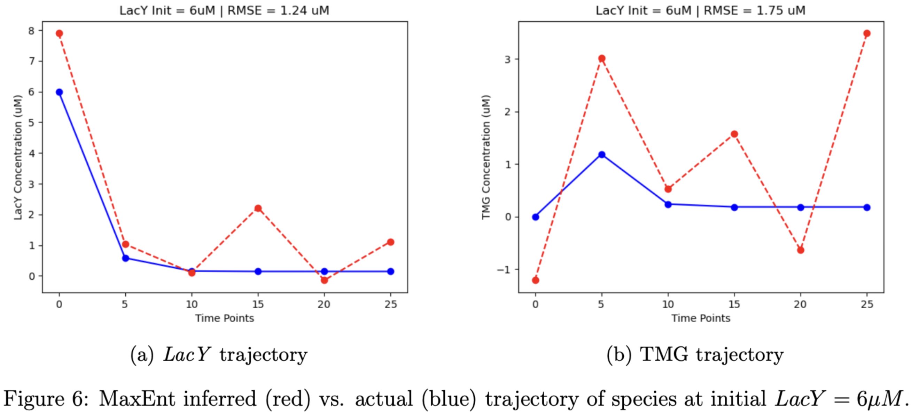

# Maximum Entropy Parameter Inference in Biological Networks

## Quick links

- [Project Summary Report [PDF]](./docs/project-report.pdf).
- [Analysis Code Notebook [Matlab LiveScript PDF]](./docs/code-notebook.pdf).
- [Synthetic Datasets [CSVs]](./data).

## Overview

- **Overarching Goal**: Appoximate biological process networks - _such as molecular signaling and protein inetractions_ - as Markov birth-death processes and infer their parameters using MaxEnt to quantitatively characterize and predict cell population response heterogeneity.

   

- Analysis of Bistability in the _Lactose Utilization Network_ of E.coli as a model network.
  
  
  
- Infer molecular abundance time-evolution trajectories using MaxEnt in the _E.coli lactose utilization network_.
  
  

## Primary References

- Dixit, Purushottam D., et al. _"Maximum entropy framework for predictive inference of cell population heterogeneity and responses in signaling networks._" Cell systems 10.2 (2020): 204-212.
- Kim, Dae Wook, et al. _"Systematic inference identifies a major source of heterogeneity in cell signaling dynamics: The rate-limiting step number."_ Science advances 8.11 (2022): eabl4598.
