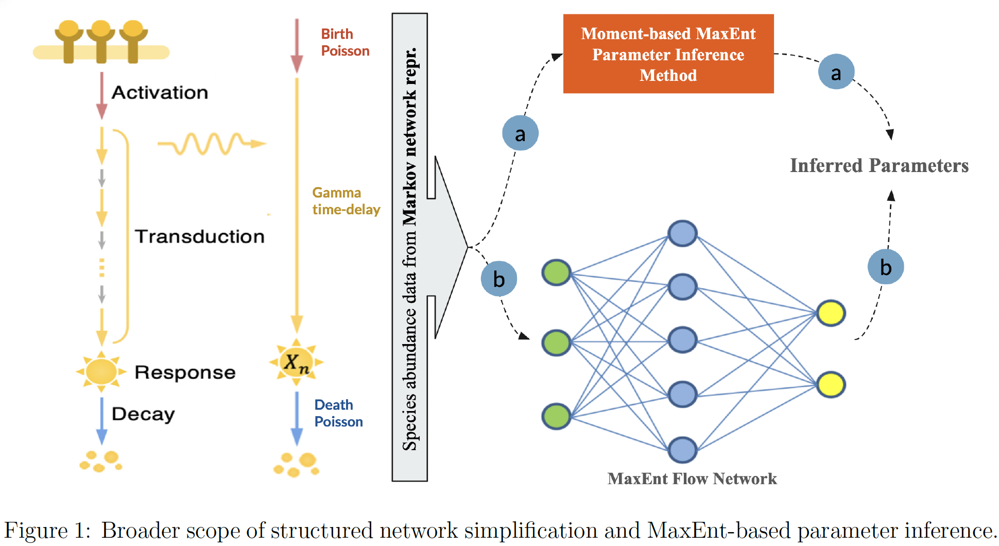
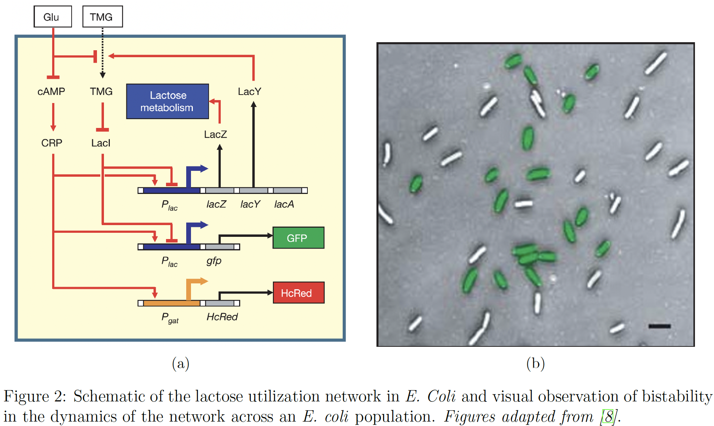

# Maximum Entropy Inference of Heterogeneity in Biological Networks

## Quick links

- [Project Summary Report [PDF]](./docs/project-report.pdf).
- [Analysis Code Notebook [Matlab LiveScript PDF]](./docs/code-notebook.pdf).
- [Synthetic Datasets [CSVs]](./data).

## Overview

- **Broader Goal**: Appoximate biological processes, such as signaling, as Markov birth-death processes and infer their parameters by MaxEnt.

   

- Analysis of Bistability in _E.coli Lactose Utilization Network_ as a model network to infer species abundance trajectories by MaxEnt.

  

## Key References

- Dixit, Purushottam D., et al. _"Maximum entropy framework for predictive inference of cell population heterogeneity and responses in signaling networks._" Cell systems 10.2 (2020): 204-212.
- Kim, Dae Wook, et al. _"Systematic inference identifies a major source of heterogeneity in cell signaling dynamics: The rate-limiting step number."_ Science advances 8.11 (2022): eabl4598.
